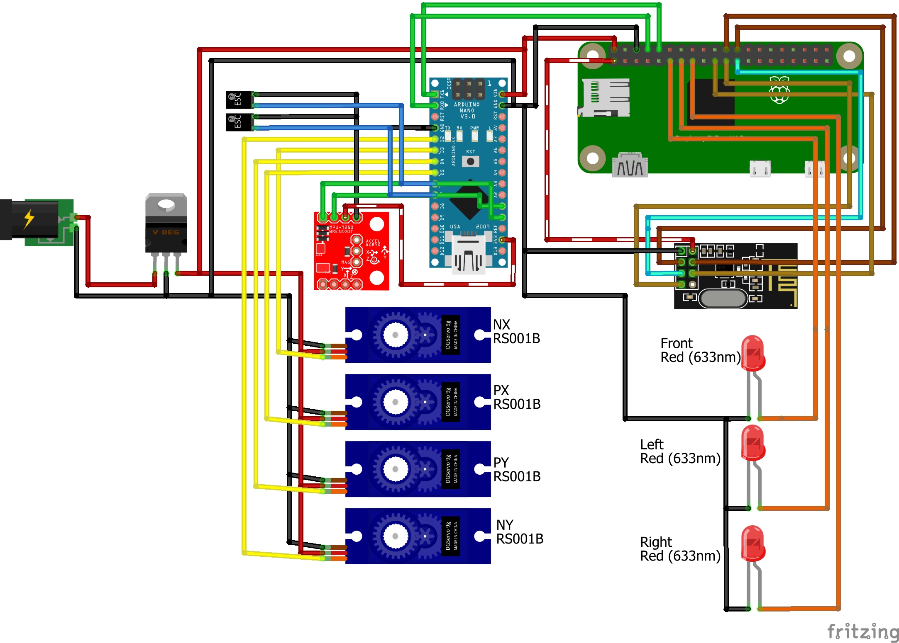

# Flea-Vehicle
The vehicle uses an Arduino Nano for low-level control to meet parameters provided by a Raspberry Pi Zero which has the flight plan as well as allows communication between the transmitter and vehicle for telemetry and commands.

The Arduino will communicate via serial to the RPi with telemetry about the state of the vehicle such as the current throttle, current fin angles, information from the IMU etc.

The RPi will give the Arduino the flight plan in stages, such as target altitude and position, it can also give the arduino instructions such as for aborting.

The RPi will transmit wirelessly the telemetry data to the transmitter as well as listen for commands from the transmitter. The RPi will also handle the lighting on the vehicle as well as test plans where it will manually tell the arduino what to do.

